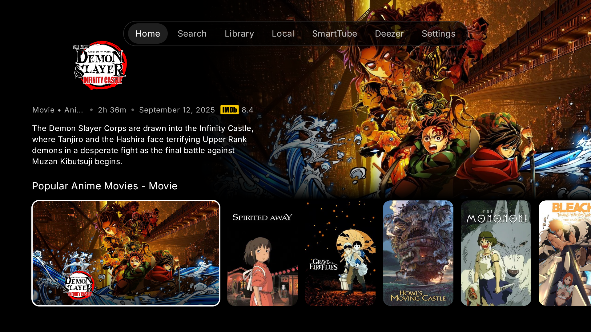
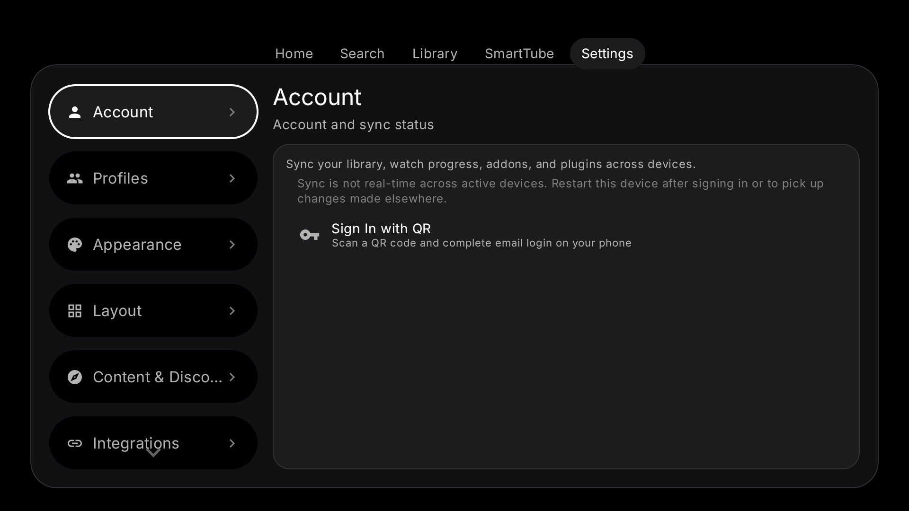

# LumaDeck

A personal Android TV media-hub customization based on the open-source [NuvioTV](https://github.com/NuvioMedia/NuvioTV) project. This is a source snapshot, not an official NuvioTV release.

It includes the TV-focused interface and in-progress additions such as CRT display options, related-title discovery, Jellyfin local-library integration, and data-import work. Some features require your own accounts, services, or network setup and may still be experimental.

## Screenshots

Anime catalog and home navigation:



Settings and account screen:



## Build

Open this project in Android Studio with a current Android SDK, then build a debug APK:

```bash
./gradlew :app:assembleFullDebug
```

On Windows, run `gradlew.bat :app:assembleFullDebug` instead. Supply any optional service settings in your own ignored `local.dev.properties` or `local.properties`; see `local.example.properties` for examples. Do not commit credentials, addon configuration URLs, signing keys, or account exports.

The project includes native libraries used by the upstream Android app. The separate Roku preview, APKs, logs, private screenshots, account data, and machine-specific files are intentionally not part of this repository.

## Attribution and license

Based on [NuvioTV](https://github.com/NuvioMedia/NuvioTV). The upstream project and this derivative are distributed under the [GNU GPL v3](LICENSE). See source files and included notices for additional attributions. This project is not affiliated with NuvioTV's maintainers or any streaming provider.

Use the app only with media and services you are authorized to access.
